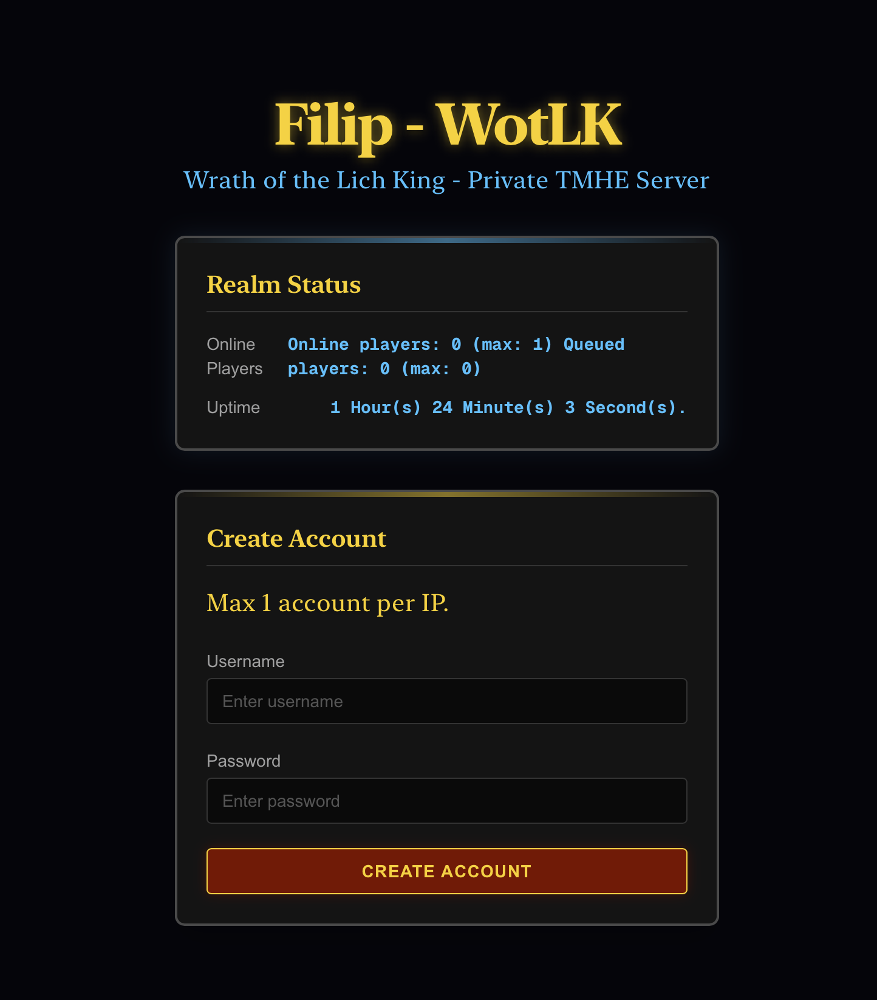

# FD WotLK Web Frontend

This is the web frontend for the FD WotLK Private Server project. It provides a modern, World of Warcraft-themed interface for users to create accounts and view server status.



## Features

*   **Account Creation**: User-friendly form to create new game accounts.
*   **Server Status**: Real-time display of online players and server uptime.
*   **WoW Theme**: Custom-styled interface inspired by Wrath of the Lich King.
*   **Responsive Design**: Works on desktop and mobile.

## Tech Stack

*   **Framework**: [Next.js](https://nextjs.org/)
*   **Styling**: [Tailwind CSS](https://tailwindcss.com/)
*   **Containerization**: Docker & Docker Compose

## Prerequisites

*   **Backend**: The FDWotlkWebApi backend must be running.
*   **Node.js**: Version 20+ (for local development).
*   **Docker**: (Optional) For containerized deployment.

## Getting Started

### Local Development

1.  Install dependencies:
    ```bash
    npm install
    ```

2.  Run the development server:
    ```bash
    npm run dev
    ```

3.  Open [http://localhost:3000](http://localhost:3000) with your browser.

    *Note: Ensure your backend is running on `http://localhost:5277` (default configuration).*

### Running with Docker

You can run the entire frontend in a container using Docker Compose.

1.  Build and start the container:
    ```bash
    docker-compose up --build
    ```

2.  Access the application at [http://localhost:3000](http://localhost:3000).

    *The Docker configuration is set up to communicate with the backend running on the host machine via `host.docker.internal`.*

## Configuration

The application connects to the backend API.
-   **Local Development**: Proxies requests to `http://localhost:5277` via `next.config.ts`.
-   **Docker**: Uses the `BACKEND_URL` environment variable (default: `http://host.docker.internal:5277`).
